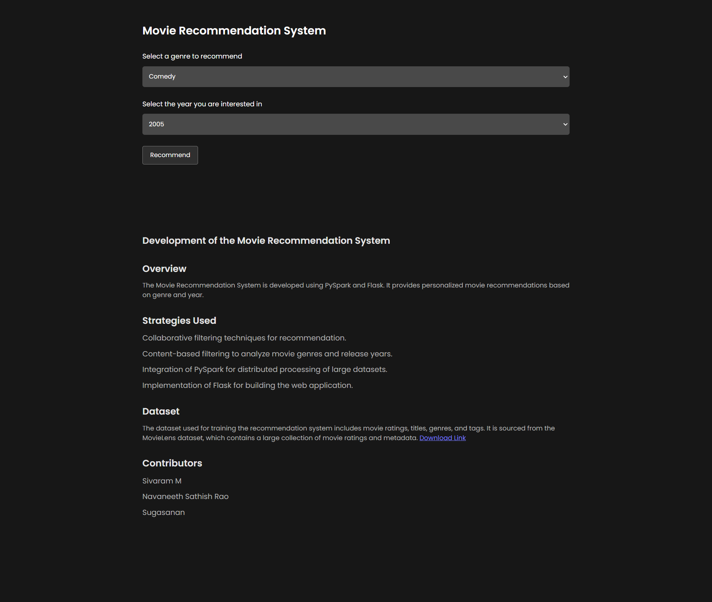
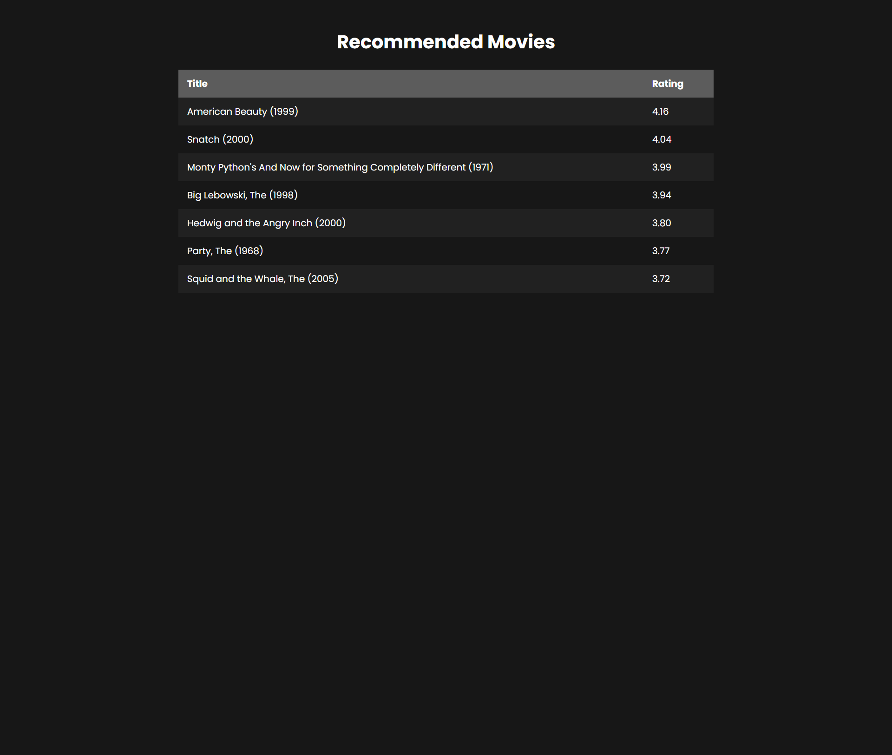

# Movie Recommendation System

This is a movie recommendation system built using Flask and PySpark. It recommends movies based on user-selected genre and release year, utilizing movie ratings and tags data to provide personalized recommendations.

## Purpose
The purpose of this project is to provide users with personalized movie recommendations based on their preferred genre and release year.

## Setup

Before getting started download the datasets from kaggle.
```
https://www.kaggle.com/datasets/rounakbanik/the-movies-dataset
```

1. Clone the repository:

   ```
   git clone https://github.com/0xramm/Movie-Recommendation-System.git
   ```

2. Navigate to the project directory:

   ```
   cd Movie-Recommendation-System
   ```
   Create a folder 'datasets' and extract your kaggle movie datasets into this 'datasets' folder
   ```
   mkdir datasets
   ```
   Make sure to extract your datasets to work without error

4. Install dependencies:

   ```
   pip install -r requirements.txt
   ```

5. Ensure the following datasets are available in the specified directory:

   - `rating.csv`: Contains user ratings for movies.
   - `movie.csv`: Includes movie titles, genres, and other details.
   - `tag.csv`: Consists of movie tags and timestamps.

6. Run the application:

   ```
   python app.py
   ```

## Screenshots






